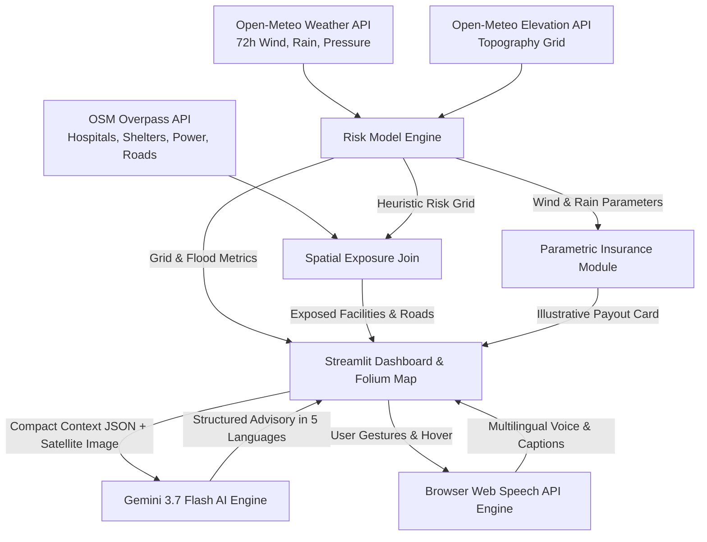

# 🌀 LandfallReady: Cyclone Impact & Infrastructure Vulnerability Forecaster

> **Build With AI: Code for Communities (Track 5: Cyclone Impact & Infrastructure Vulnerability Forecaster)**

**LandfallReady** shifts cyclone response from **post-landfall disaster recovery to pre-landfall actionable readiness** for vulnerable coastal communities along the Bay of Bengal and coastal APAC.

---

## 🎯 Problem Statement & Mission

The Bay of Bengal is host to some of the world's deadliest cyclone landfalls (e.g., Cyclone Amphan, Cyclone Fani, Cyclone Mocha). Traditional response models are largely reactive—waiting for post-landfall damage assessments before deploying aid and triggering insurance payouts.

**LandfallReady** changes this paradigm by synthesizing live weather forecasts, elevation topography, OpenStreetMap critical infrastructure, **Gemini 3.7 Flash Multimodal AI**, and an **Interactive Multilingual Audio Guide** to:
1. **Forecast spatial risk grid** (surge depth, wind decay, rain flood susceptibility) 72 hours *before* landfall.
2. **Identify critical infrastructure exposure** (hospitals, shelters, power substations, flooded evacuation roads).
3. **Generate structured, multi-lingual early-warning advisories** for municipal emergency authorities.
4. **Deliver accessibility-first audio guidance** for non-technical coastal decision makers.
5. **Trigger pre-landfall parametric insurance payouts** to provide early liquidity for vulnerable households.

---

## 🏗️ Architecture & Data Pipeline



---

## 🔊 Accessibility & Multilingual Audio Guide

LandfallReady features a built-in **Web Speech API Audio Guide (`window.speechSynthesis`)** designed for municipal officers and non-technical emergency staff:
- **Languages Supported:** English, Hindi, Bengali, Odia, Telugu (`en-IN`, `hi-IN`, `bn-IN`, `or-IN`, `te-IN`).
- **Autoplay Security Compliance:** Activates seamlessly upon user interaction ("Start Guided Tour" or first click).
- **Graceful Device Fallback:** If a specific regional voice (e.g. Odia) is missing on the user's browser, the engine displays an on-screen caption bubble, shows a friendly warning note, and plays an audio fallback without breaking the UI.
- **Floating Controls:** Mute/Unmute, Replay, Stop, and Hover Guidance toggle.

---

## 🛰️ Data Sources & AI Integration

| Data Layer | Source / Model | Description |
| :--- | :--- | :--- |
| **Meteorological Baseline** | Open-Meteo 72h Forecast API | Real-time wind speed, gusts, pressure, and accumulated rainfall. |
| **Topography & Elevation** | Open-Meteo Elevation API | Ground elevation grid (m) for storm surge submersion math. |
| **Critical Infrastructure** | OpenStreetMap Overpass API | Live spatial query for hospitals, shelters, power grids, and trunk roads. |
| **Multimodal Reasoning** | **Gemini 3.7 Flash** (`google-genai`) | Multimodal analysis of risk context & satellite imagery with exponential backoff & model fallbacks. |
| **Audio Guidance** | Web Speech API + Gemini Translations | Zero-latency browser TTS with pre-generated regional translations. |

---

## 🚀 Quickstart & Local Setup

### 1. Prerequisites
- macOS / Linux / Windows
- Python 3.10+ (Tested on Python 3.13)

### 2. Installation
```bash
# Clone repository
git clone https://github.com/your-username/landfallready.git
cd landfallready

# Create and activate virtual environment
python3 -m venv venv
source venv/bin/activate  # On Windows: venv\Scripts\activate

# Install direct dependencies
pip install -r requirements.txt
```

### 3. Environment Secrets Setup
Create a `.env` file in the root directory (do NOT commit this file):
```env
GEMINI_API_KEY=your_gemini_api_key_here
GEMINI_MODEL=gemini-3.7-flash
```

### 4. Run Application
```bash
streamlit run app.py
```

---

## ⚠️ System Limitations & Heuristic Model

- **Heuristic Physical Approximation:** LandfallReady uses a simplified parametric model (exponential wind decay $v = v_{max} \cdot e^{-d/d_0}$, empirical surge $S = 6.0 \cdot (v/200)^2$, flood depth $F = \max(S - E, 0)$). It is explicitly **NOT a hydrodynamic simulation** (like SLOSH or ADCIRC).
- **Overpass API Fallback:** If public OSM Overpass servers time out during high load, LandfallReady seamlessly switches to a realistic built-in demo dataset to guarantee zero UI disruption.

---

## 🗺️ Future Strategic Roadmap

1. **Cloud Text-to-Speech / Gemini TTS:** Integrate neural high-quality regional voice synthesis for Odia, Bengali, and Telugu.
2. **Google Earth Engine (GEE) Integration:** Incorporate real-time Sentinel-1 SAR radar satellite moisture and optical cloud imagery.
3. **Hydrodynamic Modeling:** Integrate ADCIRC/SLOSH storm surge tide gauge dynamics.
4. **BRICS & APAC Federated Model Sharing:** Enable cross-border disaster authorities (India, Bangladesh, Myanmar, Sri Lanka) to share privacy-preserving federated cyclone risk parameters.

---

## ☁️ Deployment Notes (Streamlit Community Cloud)

When deploying to Streamlit Community Cloud:
1. Add `GEMINI_API_KEY` and `GEMINI_MODEL` under **App Settings -> Secrets**:
   ```toml
   GEMINI_API_KEY = "your_api_key"
   GEMINI_MODEL = "gemini-3.7-flash"
   ```
2. Verify `.gitignore` contains `.env`, `venv/`, `__pycache__/`, and `.streamlit/secrets.toml`.

---

## 📄 License
Developed for Build With AI Hackathon (Track 5). Open-source for community disaster resilience.
